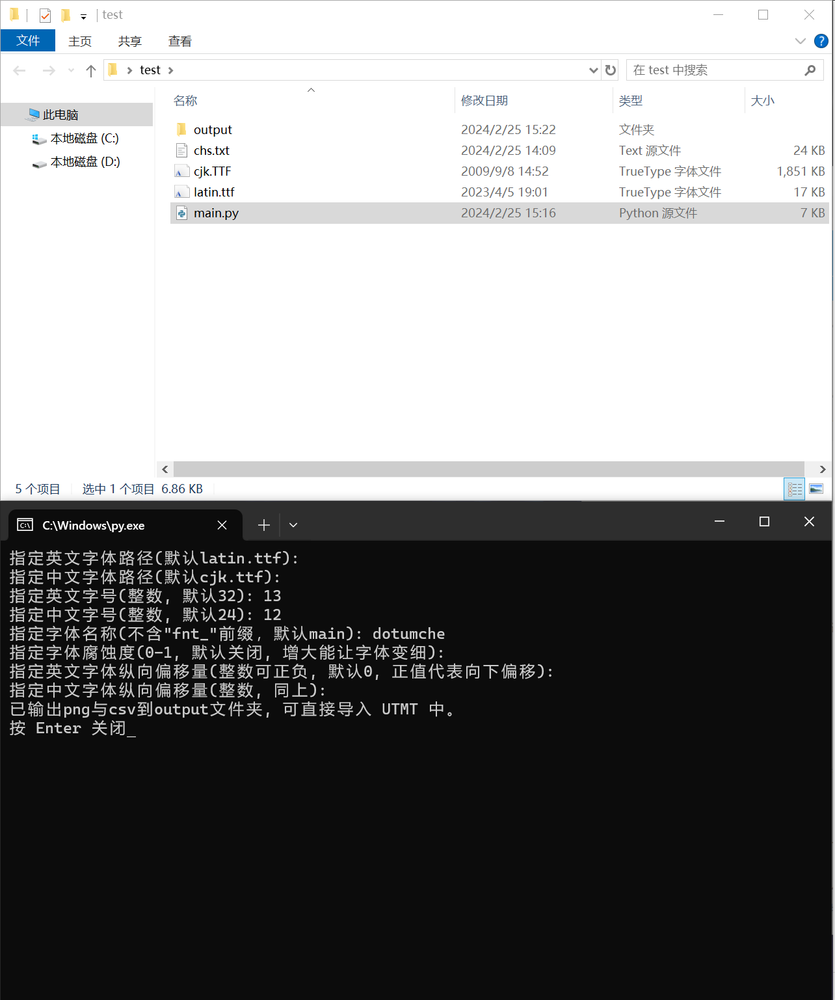
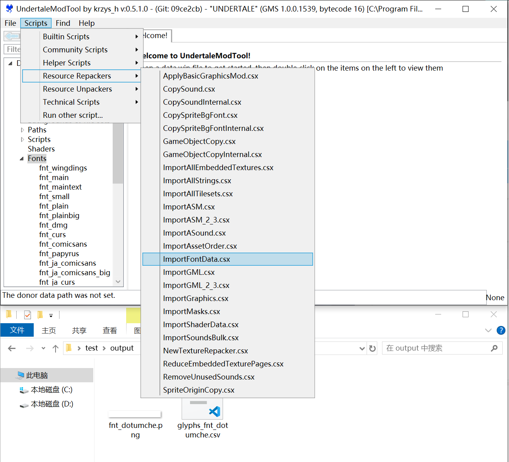
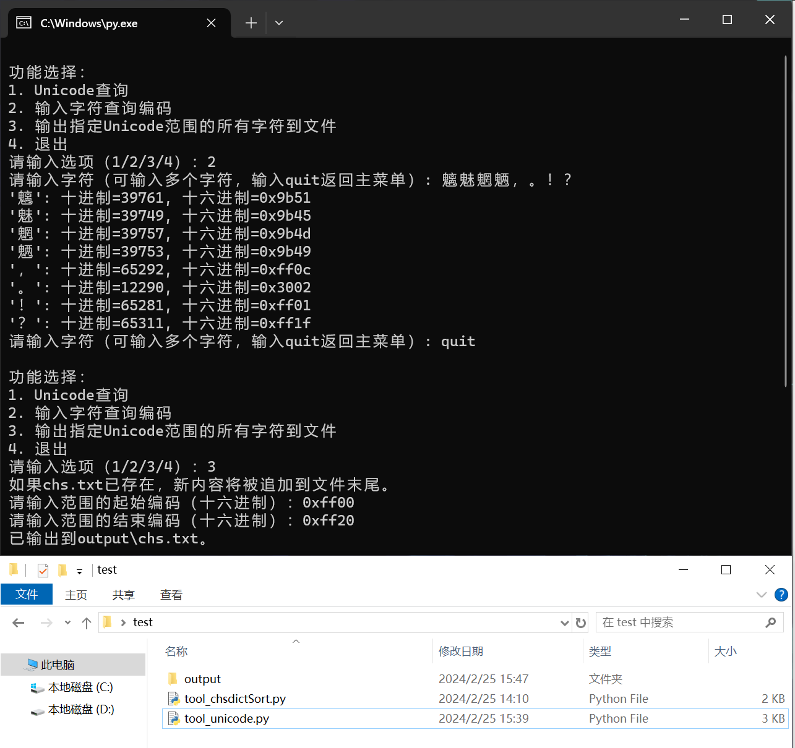
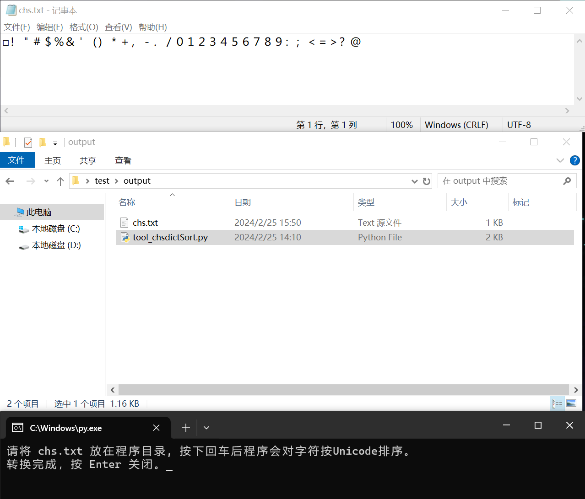
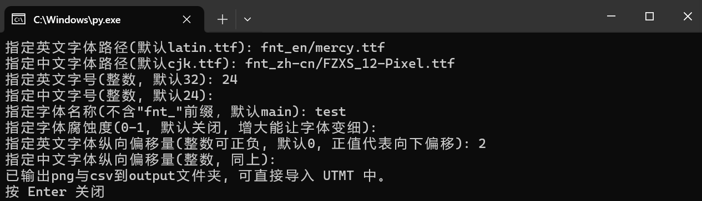
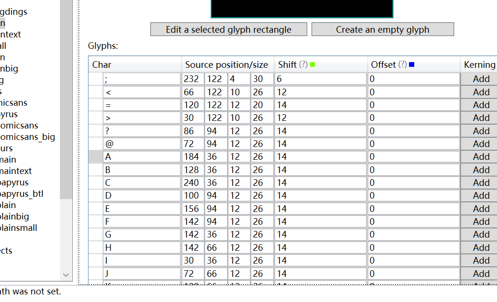

# GMS 字库生成器：添加自定义字体及补全字库


[toc]

## 工具介绍

GMS字库生成器是一个为Gamemaker Studio游戏制作的实用字体导入/处理工具，特别适用于Undertale同人游戏或其他基于GMS的游戏。它能够将TTF字体文件转换成可以直接导入到游戏中的格式，支持中文、英文以及其他非ASCII字符，帮助游戏翻译者轻松添加自定义字体，补全字库并对字体进行微调。

## 使用方法

1. **想要为Undertale 同人游戏或其他 GMS 游戏导入中文字体：**

   **第一步，**将所需英文字体和中文字体的 TTF 文件，及字库文件 `chs.txt` 放置到主程序 main.py（或 main.exe）目录下，分别命名为 `latin.ttf`和 `cjk.ttf` 。

   **第二步，**运行主程序，路径无需设置直接回车确定，中英文字号根据情况设置（**可参考"ut常用字体配置.md"**），名称和 UTMT 中字体名称一致，其余选项回车默认即可。

   第三步，成功生成字图后，在 UTMT 中使用 `ImportFontdata`  脚本选择 `output` 文件夹导入即可。


2. **想制作自定义字库文件：**

   默认的字库文件已经包含了大量汉字和常用字符，如果觉得字体太多或想添加其他字符可以自定义字库，有两种方法：

   **方法一：**上网搜索所需的字符库，直接将字符集复制粘贴到 `chs.txt` 文件中。随后运行 `tool_chsdictSort` 小工具对字符进行排序和去重，处理后的 `chs.txt` 即可作为主程序的字库使用。

   **方法二：**使用 `tool_unicode` 工具查询和反查编码，获得所需字符的编码范围，随后使用该工具生成指定编码范围的所有字符并输出到文件 `output/chs.txt` **（注：如果该文件已存在将在后面追加新生成的字符）**，最后运行 `tool_chsdictSort` 对字符进行排序和去重。

   **不要省略排序和去重这一步，否则可能造成字体存在但在游戏中不显示、缺失等bug。**

3. **想修复 TS! Underswap 中文字体间距的问题：**

   TS! Underswap 通过 JSON 文件单独指定每个字符的宽度和偏移量。

   **第一步，**将语言配置的 JSON 文件 (游戏目录 `data/default.json` )及字库 `chs.txt` 放置到 `tool_genelangJSON` 小工具的目录下。

   **第二步，**随后运行工具，指定配置文件路径及字宽（无特殊要求可直接保持默认设置），片刻后导入完成的 JSON 文件将输出到 `output/chs.json` ，可以复制到游戏目录 `data/lang/` 使用。

## 文件列表

### 文件

`main.py`: **主程序**，将 TTF 字体文件转换为可以直接导入到 UTMT(Undertale Mod Tool) 的字图 PNG 和字体信息 CSV 文件，可以自定义中英文字体，字号及字库。

`chs.txt`: **字库**，包含所有非 ASCII 标准字符（如汉字、中文标点、特殊符号等），主程序生成字体图片和CSV需要读取其中的内容，默认的字库文件包含 《通用规范汉字表》中所有规范字和常用中文符号，也可手动添加其他语言的字符，如日文、韩文等。

`tool_genelangJSON.py`: **小工具**，用于 TS！Underswap，可读取游戏语言配置 `JSON`，批量设置中文字体的字宽和横向偏移量，解决 TS! Underswap 汉字重叠问题。可针对每种字体单独指定字宽，相比直接文本中添加空格的方式更加灵活。

`tool_chsdictSort.py` : **小工具**，用于将 chs.txt 内字符按照 Unicode 进行排序并去除 UTMT 无法导入的字符。对于自定义字库生成的字体图片，直接导入游戏会出现缺字不显等bug，可用此工具修复。

`tool_unicode.py`: **小工具**，提供字符的 Unicode 编码查询和反查功能，以及指定编码范围批量输出字符到文件（可分段输出），可用来批量生成字库。

`ut常用字体配置.md`: **列举了 Undertale 中常用字体及对应的字号信息。**

主程序和小工具都提供了可直接执行的 exe 版本（使用 Pyinstaller 打包），供未安装 Python 的用户使用。

### 文件夹

`output`: 是主程序和 `tool_genelangJSON.py` 的输出目录，生成的 PNG，CSV，JSON 都会存储在这里。
默认的 `output` 文件夹已经包含主程序输出的 Undertale 主要字体的字图文件，可直接用 UTMT 导入。

`fnt_en`: Undertale 使用的英文字体 TTF 文件，所有字体均为像素化之后的字体，可用来制作字图。

`fnt_zh-cn`: Undertale 汉化版使用的中文字体 TTF 文件，可用来制作字图。

`exe`: 主程序和小工具的 EXE 可执行文件，如果未安装 Python 可直接复制到上一级目录使用。

## 使用截图

  ### 导入字体



   

   ### 自定义字库



   

## 常见问题

#### 主程序中的“字体腐蚀度”是什么意思？为什么我生成的字体边缘模糊？

**简单版：**如果使用的字体不是像素字体（而是矢量字体），字体腐蚀度越高，字体越细（甚至可能出现中断），反之越粗（但可能糊成一片）。如果没有指定字体腐蚀度边缘会由于抗锯齿而出现渐变，设置任意一个腐蚀度的值就可以解决这一问题。

如果使用的源字体本身为像素字体（比如方正像素12-Pixel）则腐蚀度无效，也不会出现模糊的问题

**详细版：**

将矢量字体转换为像素字图的过程必定伴随字形的扭曲，模糊等。为了保证生成的字体效果，程序首先将字体采用 4 倍字号渲染（比如，指定字号12，将会以48号渲染）。可是，即使是放大的字号渲染，字体的边缘仍会出现渐变的半透明白色（如图）：

像素化时这些半透明像素会影响字体的锐利度，需要将字图变成只有白色（不透明）和黑色（全透明）两种颜色，就需要决定这些半透明像素转换为“白色”还是“黑色”。

因此引入“腐蚀度”，腐蚀度实际是一个透明度阈值，当值设置为1时，所有的半透明均设置为黑色，而阈值设置为0时，所有的半透明像素则全部设置为白色。对所有像素处理过一遍后，图片就只剩下“纯黑”和“纯白”两色了。

此时再使用临近像素方法将字图缩小回原尺寸（这种缩小不会引入半透明边缘，能保证边缘的锐利度），就形成了最终的字图。


#### 游戏内中英文字体高度不统一，英文字体总是比中文字体高/低，怎么办呢？

可以在生成字体时时候单独设置两种字体的Y轴偏移量，如果英文字体高于中文字体，可设置中文字体正偏移，反之，可设置英文字体正偏移或中文字体负偏移：

（偏移量通常5像素以内即可，过大的正偏移可能会导致字形部分缺失（没有上半部分））



#### 游戏中出现缺字现象！

首先检查字库 `chs.txt` 是否有缺失的字符。如果字库缺失字符，将其补上并重新生成字图即可（**推荐使用默认的字库 `chs.txt`，不太可能出现字库缺失中文字符的问题**）；

如果字库有对应字符，检查使用的字体TTF是否可以显示这一字符。如果是使用的字体缺失对应字符可考虑替换字体或手动将其他字体的自行图片粘贴到空缺字图位置（未来会考虑更好的解决方案）；

如果这两点都没问题，可能是字库内字符未正确排序，使用 `tool_chsdictSort.py` 工具处理字库后重新用主程序生成字图并导入即可解决问题。

#### 游戏内字体间距过宽/过窄

**简单版**：对于菜单字体：修改字体csv的 `shift` 值（可直接修改csv文件或通过主程序生成） ；对于对话和战斗文本，TS! Underswap 可使用小工具 `tool_genelangJSON.py` 对字体独立设置字宽，其他 GMS 游戏可调整代码逻辑设置相应判定。

**详细版：**

对于 UT 类游戏，控制字体间距通常有两种机制：

**一类是对话文本、战斗云图等**，这部分采用游戏内代码控制字体所在X，Y。可以使用 UTMT 修改游戏中 `width` 变量出现所在的代码（具体操作是，添加判断当前字符种类的代码，并根据待输出的字符编码决定输出下一个字符时右移的 X 坐标，比如（代码来源：Undertale Yellow demo 使用 UTMT 反编译）：

```c++
var charWidth, line, space, tY, tX, length;
draw_set_font(fnt_mainb);
draw_set_colour(c_white);
message_end = array_length_1d(message);
if ((message_end > 0))
{
    // ...
    tY = (view_yview[0] + 265);
    tX = (view_xview[0] + 60);
    while ((i <= string_length(message[message_current])) && (i <= cutoff))
    {
        var currentChar = string_char_at(message[message_current], i);
        // 判断当前字符是否为英文字符
        if (ord(currentChar) >= 32 && ord(currentChar) <= 127)
        {
            charWidth = 16; // 英文字符宽度
        }
        else
        {
            charWidth = 24; // 中文或其他字符宽度
        }
        
        // 更新绘制文本的逻辑，以反映charWidth的变化
        draw_text(((tX + (space * charWidth)) + random_range(-0.5, 0.5)), ((tY + (13 * line)) + random_range(-0.5, 0.5)), currentChar);
        
        // 根据字符宽度更新space
        if (charWidth == 16) {
            space += 1; // 对于英文字符，space增加的少一些
        } else {
            space += 1.5; // 对于中文字符，由于宽度更大，space相应增加的更多
        }

        i++;
    }
}
```

有些游戏会读取外部配置来更方便地调节这类字宽和间距，比如TS! Underswap（**点名表扬**）使用 JSON 来设置字宽，此时通过 `tool_genelangJSON.py` 小工具设置字宽。

**二是菜单字体。**这类字体的间距通过设置每个字符的 `shift` 来指定，通常而言，将 `shift` 设置为字宽+2即可获得不错的显示效果。：



## 未来考虑添加的功能

1. 读取已有字库并进行特定字符的补字；
2. 中文可设置2种字体：一种字体作为主字体，一种字体作为当第一种字体缺字时的缺省字体（避免游戏内缺字）；
3. 用于字体位置和间距微调的可视化调试工具（更好地解决中英文混排时间距、高低不统一）。